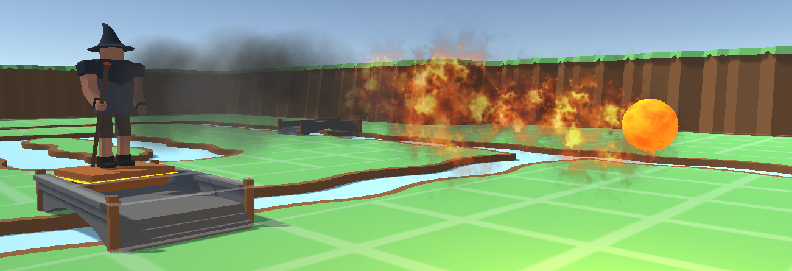

# Welcome to my Portfolio

**Home**
|
[Browse Projects](pages/browse_projects/browse_projects.md)
|
[Contact Me](pages/contact_me/contact_me.md)

## About Me

Hi, my name is James Goodman, I am a knowledgeable and skilled Unity programmer who has a passion for software and games development that extends beyond my professional career into my personal projects. Backed by a *2:1* BSc degree in *Computer Science with Games Development* from the *University of Sussex*, I enjoy the challenge of engaging with new projects and learning new techniques, tools and languages that I can use to further improve my programming abilities.

As a professional Unity developer and games dev enthusiast I enjoy the challenge of creating fun and unique experiences on both mobile and desktop platforms, as well as experimenting with new features and genre combinations I haven't tried before. Notably designing, developing and releasing a word-based Unity mobile game called *Letter Chain*. I also enjoy 3D modeling for use in both personal projects and 3D printing, which has helped me to better understand the design and artistic workflows of those in my team.

## Letter Chain

My enthusiasm for game development has led me to broaden my skills in Unity during my free time, by creating an android app called “Letter Chain”, which I have since released to the play store. This involved using Unity Services to set up Ad Monetization and fulfilling the various requirements of releasing an app using the Google Play Console.

[**Letter Chain Project Page**](pages/games/letter_chain/letter_chain.md)

## Heroes Quest

The aim for my dissertation was to take the existing rule-set and core gameplay elements of Dungeons & Dragons and implement them into an exciting desktop game designed around start-stop gameplay and user created content.

[**Heroes Quest Project Page**](pages/games/heroes_quest/heroes_quest.md)

## Lunar Defence

Lunar Defence is a fast paced mobile game designed for the Google cardboard VR headset. Players must defend their base from the imminent threat of a meteorite storm but taking control of the bases many turrets to blast the rocks out the sky.

| ![Lunar Defence Gameplay][1] | ![Lunar Defence Gameplay][2]  |

[1]: pages/games/lunar_defence_vr/images/gameplay_4.png "Lunar Defence Gameplay 4"
[2]: pages/games/lunar_defence_vr/images/gameplay_5.png "Lunar Defence Gameplay 5"

[**Lunar Defence Project Page**](pages/games/lunar_defence_vr/lunar_defence_vr.md)

## 3D Modeling

In my spare time I also like to create 3D assets for use in both my personal projects and for 3D printing. These range of a variety of models from construction equipment inspired by my job at Costain to low poly assets for blocking out a scene. It also allows me a great insight into the workflows of artists and designers and how it meshes with development. The page below contains examples of some of my work.

[**3D Modeling**](pages/modeling/modeling.md)

### Browse

A list of all projects can be found on the "Browse Projects" tab. Projects are divided into sub-categories based on origin or purpose.

Each project's page features a short description about its purpose as well as videos and screenshots of the software in action.

However should you want to try out or mess around with any of the projects links to the repositories are provided.