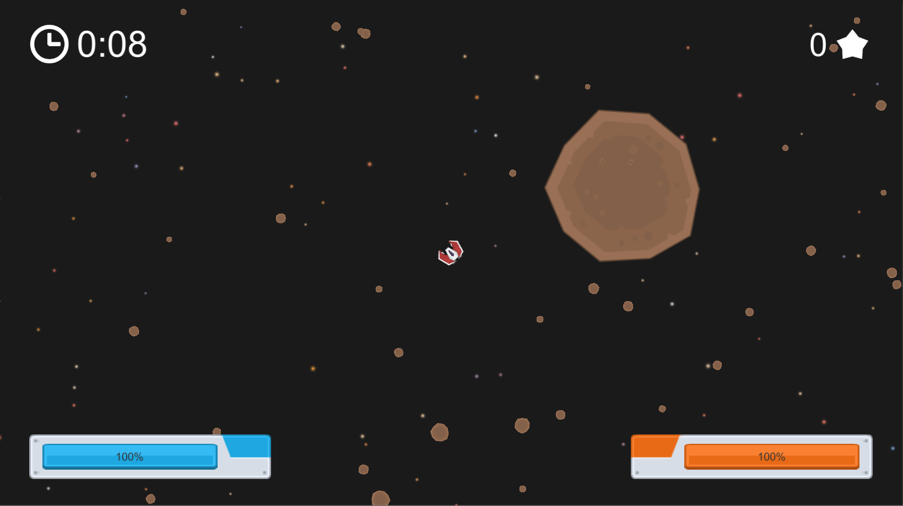
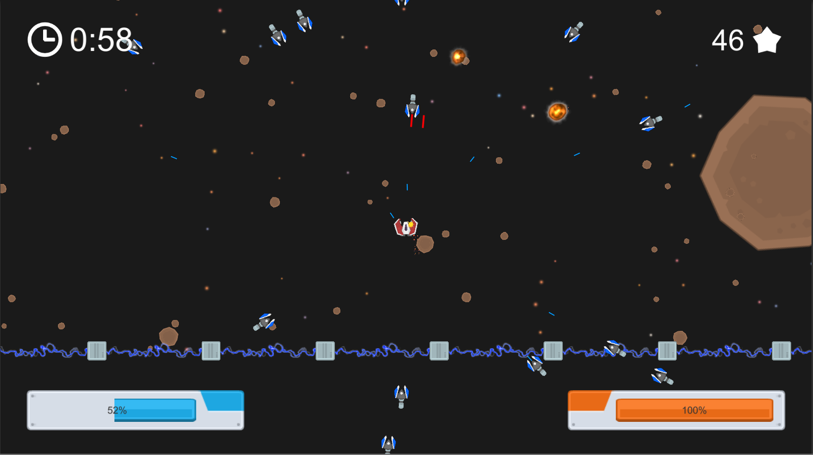
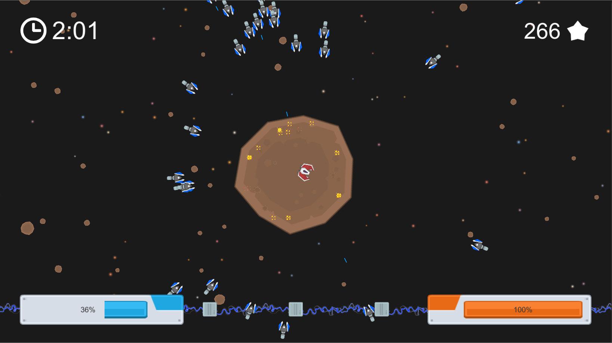
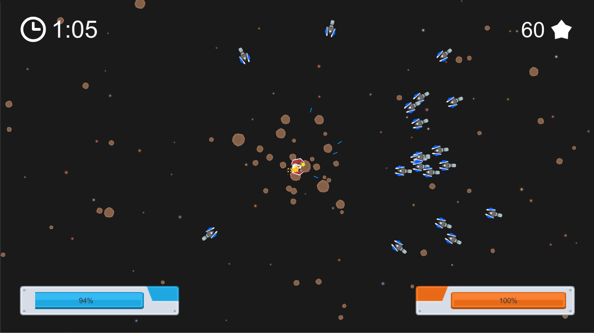

# Ship Smash

[Home](../../../index.md)
|
[Browse Projects](../../browse_projects/browse_projects.md)
|
[Contact Me](../../contact_me/contact_me.md)

## Overview

Ship Smash is a fast-paced top-down space shooter where you the player must battle against wave upon wave of enemies with nothing but your tiny little fighter to hold them back.

Waves are every increasing in number with your score being just how long you can survive the onslaught. The aim of the game is to survive as long as possible, as the time progresses the number of enemies continues to increase until the player is overwhelmed.

Enemies will attempt to orbit the play and cut them off from flying away by surrounding them. Spread around te map are asteroids that the player can use for a temporary withdrawal from enemy fire, by these safe havens don't last for long.

## Media

Here are a video of the game in action.

[Gameplay Playthrough Video](https://www.youtube.com/watch?v=vBxtv6kNirM)

## Download

If you would like to browse the project source code for yourself you can download the Unity3D project from the link below.

[Ship Smash Repository](https://github.com/JGoodHub/Ship-Smash)

If you would like to play the game a pre-built version of the game can be found in the "Build" root directory, this contains a demo for you to play test the latest version of the game.

## Screenshots

Various gameplay screenshots

