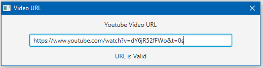
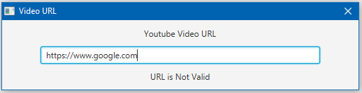
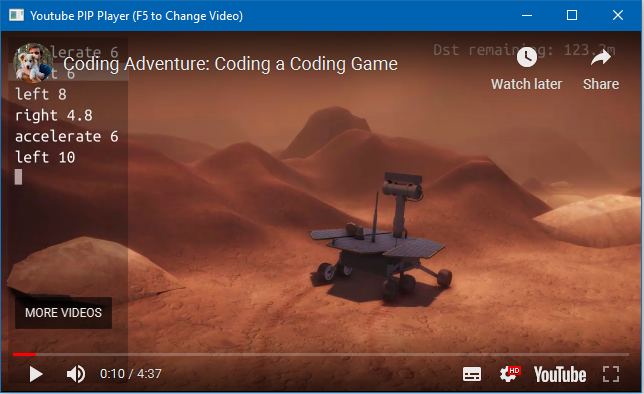

# "Play In Picture" Player

[Home](../../../index.md)
|
[Browse Projects](../../browse_projects/browse_projects.md)
|
[Contact Me](../../contact_me/contact_me.md)

## Overview

The PIP Player rather "Play In Picture" Player is a Java application designed to combat the issue of small screen real estate. THe player is designed to take in a youtube video link and then displays it in a dedicated window. The advantage of this is that the window is coded to always render on top of the windows behind it. This means that a user can have say a programming tutorial loaded up at the same time as using an IDE in fullscreen mode.

## Media

Here is a video of the player being used to load up a programming video, overlaying the Netbeans IDE.

[Player Demo Video](https://www.youtube.com/watch?v=YlGqGQ612u4)

## Download

If you would like to browse the project source code for yourself you can download the project from the link below.

[PIP Player Repository](https://github.com/JGoodHub/Play-In-Picture-Player)

A pre-built version of the application can be found in the "dist" root directory, this contains a runnable version of the software, a .jar file, that you can use on your machine.

## Screenshots

Taking the users valid youtube link as an input.

Rejecting an invalid youtube link.

Displaying the associated video in a WebView container.

