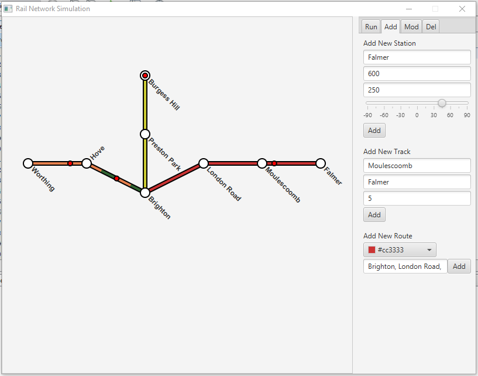

# Rail Network Simulator

[Home](../../../index.md)
|
[Browse Projects](../../browse_projects/browse_projects.md)
|
[Contact Me](../../contact_me/contact_me.md)

## Overview

Rail network simulator is a tool designed to mimic the iconic style and layout of the London Underground tube map. The user is able to add stations or stops to the map and then connect those using tracks. FInally you specify which stations are on a trains routes and how go.

The simulation then runs trains along the routes you creating, showing your miniature rail system in action. The end goal for the project is to also have the simulator account for varying levels of foot traffic and different times of the day, as well as the ability to bypass some stations or wait outside others for previous trains to leave.

## Media

Here is a video of the rail network being created.

[Creating the Network Video](https://www.youtube.com/watch?v=rLaGdf2MzBQ)

Here is a video of the above network in action.

[Running the Simulation Video](https://www.youtube.com/watch?v=vdDDzQXX0IQ)

## Download

If you would like to browse the project source code for yourself you can download the project from the link below.

[Rail Network Simulator Repository](https://github.com/JGoodHub/Rail-Network-Simulator)

A pre-built version of the application can be found in the "dist" root directory, this contains a runnable version of the software, a .jar file, that you can use on your machine.

## Screenshots

Screenshot of the application in action.

