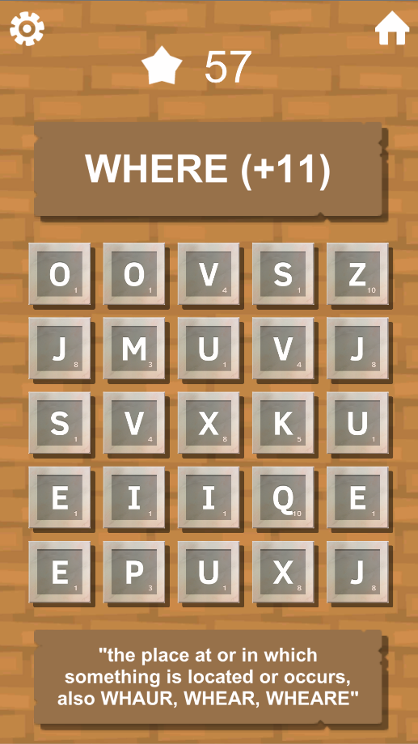

# Letter Chain

[Home](../../../index.md)
|
[Browse Projects](../../browse_projects/browse_projects.md)
|
[Contact Me](../../contact_me/contact_me.md)

## Overview

Letter Chain is a word based puzzle game where you must join together letters to create words and score points. Presented with a grid of letter tiles the user can tap or drag their finger to swap tiles and form chains. The app features three core games modes, Time Trail where the player must aim to get the highest score possible before the time runs out. Free play, where there is no time limit and players can chain letters at their own pace, potentially discovering words you never knew existed. And Survival, where players must score words to keep their timer above zero and stay in the game as long as possible.

When the player completes a word, as well as awarding them a well earned points increase the game also serves up that words definition, this allows for the players to learn more about words they thought they knew, or potentially learn about words they never knew to start with.

## Media

Here are a video of the game in action.

[Gameplay Playthrough Video](https://www.youtube.com/watch?v=cIrHGC4JRto)

## Download

If you would like to browse the project source code for yourself you can download the Unity3D project from the link below.

[Letter Chain Match Repository](https://dev.azure.com/JGoodHub/_git/Letter-Chain)

If you would like to play the game it can be found on the android Google Play Store below.

[Letter Chain Play Store](https://play.google.com/store/apps/details?id=com.mellow_madnes_games.letter_chain)

## Screenshots

Various gameplay screenshots

Photo of the game running on an android device.

