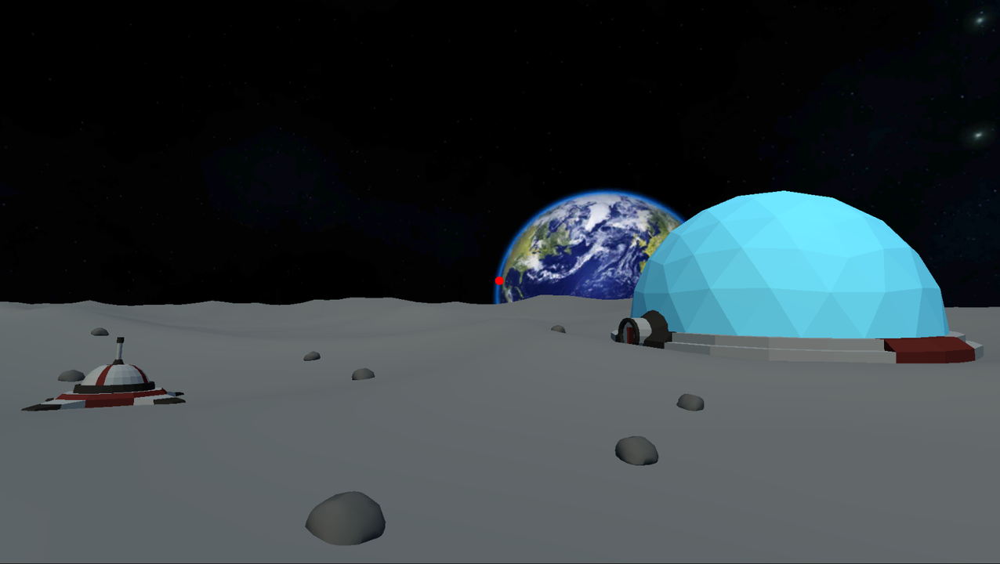
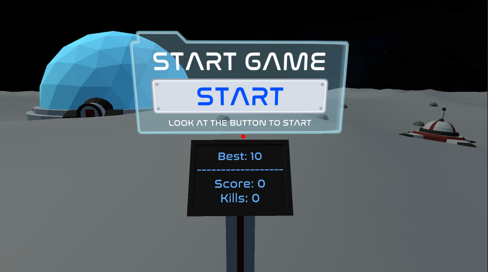
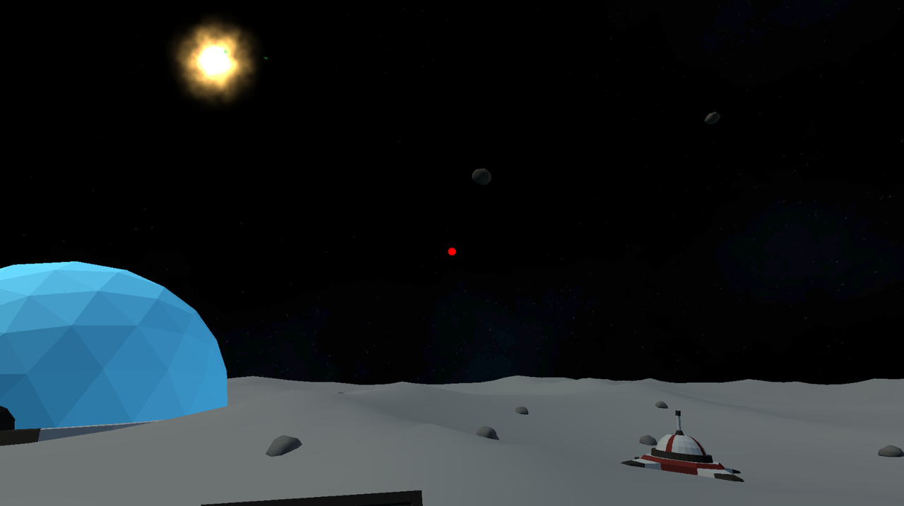
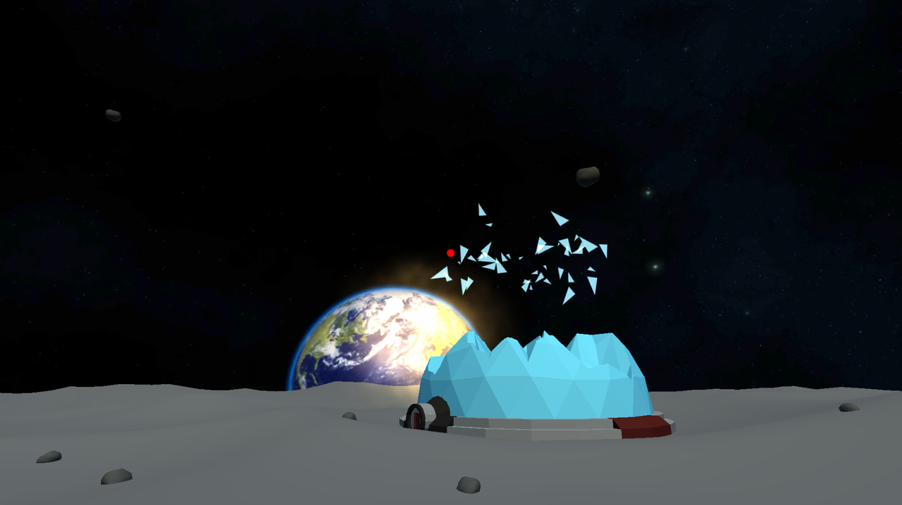

# Lunar Defence VR

[Home](../../../index.md)
|
[Browse Projects](../../browse_projects/browse_projects.md)
|
[Contact Me](../../contact_me/contact_me.md)

## Overview

Lunar Defence is a retro inspired mobile game designed for the Google Cardboard VR headset. The player is tasked with the challenge of defending Earths lunar colony from an incoming meteor storm. Using the bases turrets and their head mounted targetting system the player must lock on to the asteroids and blow them out the sky or face the shattering consequences.

## Game Design Document

### Platform

The game will be targeted for the GoogleVR android platform.

### Story

Shortly after setting up the first lunar based colony in an effort to explore worlds unknown an alert is triggered for an impending meteor storm, as everyone panics the player must brave the danger and single handily fend off the pesky rocks from hitting the bases core buildings.

### Player

The user plays as the colonies only turret defence, a simple auto cannon.

### Environment

Game will be based on the surface of the moon, therefore ground will be a grey uneven dusty surface with minor rocks and scenery, e.g. tools and equipment strewed about.

Around the player will be three key structures.

The habitat and a large domed building that houses all the lunar colonists, its the biggest building in the colony and has the highest health.

The science lab is a medium sized building used for scientific research of the moons surface. It's a long sleek building akin to a greenhouse but with more wires, pipes and glowy bits.

Finally the power generation station is the last key structure in the colony, it features several controls boxes with tesla coil appendages and several large solar arrays that cover a large area of the moons surface.

The three structures are placed equally distance from the turret in a circular pattern.

### Gameplay

The player controls the turrets at the centre of the base and must defence the colonies key structures from destruction.

The main enemy for the game will be a meteor storm, meteor's will spawn at random point on the shell of a hemisphere around the base. Each rock will spawn with either a guaranteed target building or a random ground location inside the colony. The player must shoot down the meteors before they reach the ground and impact the colony.

Each building has a set number of hit points which are reduced when a rock collides with it, the amount reduced is based off of the size of the rock.

Overtime the intensity of the storm increases until the colony is eventually destroyed. The players final score will be a combination of the time survived, rocks destroyed and hit points remaining on the colony.

### Art

The art for the game will be designed and modelled in blender. Low polygon art will be used to reduce strain on the players phone and improve the VR experience.

### UI and Controls

The games only method of interacting with the UI will be for the player to hover their vision over a certain element, which after a set period of time will trigger that button, switch, etc.

In game the player will have a choice of two firing methods.

Method one is for the player to only look around using the VR headset and firing is handled by pressing either the mouse or space bar.

Alternatively method two will have the turret fire automatically when the player looks within a certain radius of a meteor. This radius would be proportional to the visual size of the meteor as it approaches.

## Media

Here is a video of the game in action, using the built in "in-editor" simulator.

[Gameplay Playthrough Video](https://www.youtube.com/watch?v=DeFq1LP0xew)

## Download

If you would like to browse the project source code for yourself you can download the Unity3D project from the link below.

[Lunar Defence Repository](https://github.com/JGoodHub/Lunar-Defence-VR)

## Screenshots

Various gameplay screenshots

