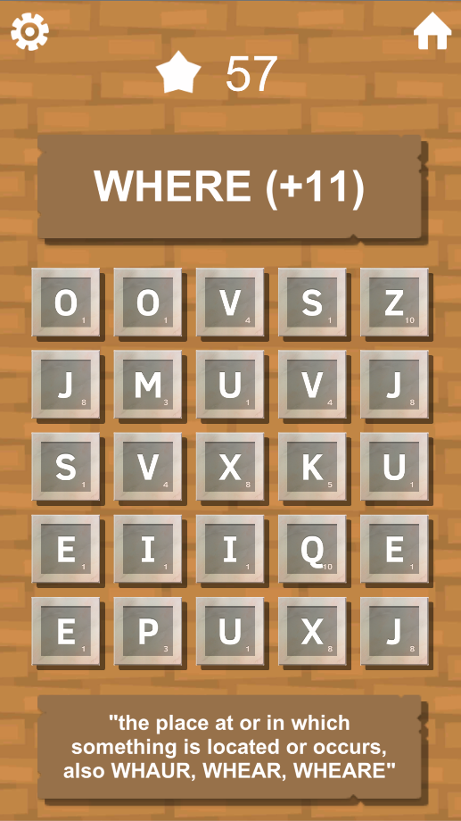
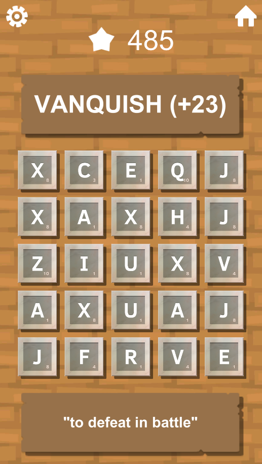

# Scrabble Match

[Home](../../index.md)
|
[Browse Projects](../browse_projects/browse_projects.md)
|
[Contact Me](../contact_me/contact_me.md)

## Overview

Overview

## Media

Here are a video of the game in action.

[Gameplay Playthrough](https://www.youtube.com/watch?v=)

## Download

If you would like to browse the project source code for yourself you can download the Unity3D project from the link below.

[Scrabble Match Repository](https://github.com/JGoodHub/Scrabble-Match)

If you would like to play the game a pre-built version of the game can be found in the "Build" root directory, this contains a demo for you to play test the latest version of the game.

As this project was designed with Android being the target system a pre-built APK file can also be found in the Build folder and used to install the game onto any Android device.

## Screenshots

Various gameplay screenshots

