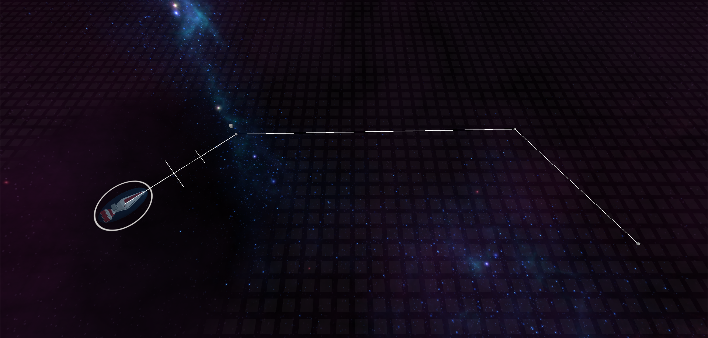
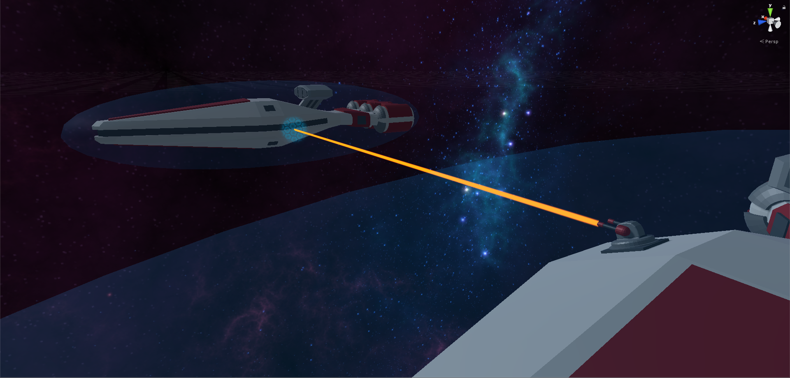
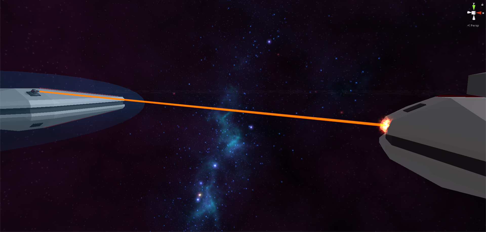
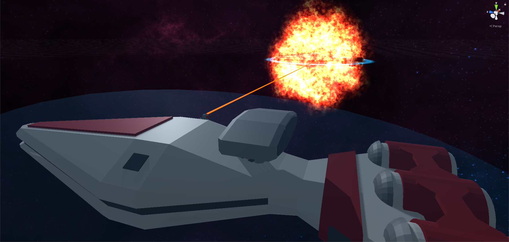

# Stellar Strategy

[Home](../../index.md)
|
[Browse Projects](../browse_projects/browse_projects.md)
|
[Contact Me](../contact_me/contact_me.md)

## Overview

Stellar strategy is a work in progress space-combat RTS/Real Time Strategy game. Once complete the game will allow for two players, be them human or AI to battle against one another using an wide arsenal of ships and weapons on a solar system scale map.

In its current state the game allows for players to select ships in their armies and move them about the map. Furthermore ships can and will fire upon enemies once they're in range. If a ships are equip with rechargeable shields but if one takes enough damage they're destroyed in an explosive fashion.

The idea and inspiration for the project came for the 2006 Star Wars RTS, Empire At War, whose space battles took a similar, albeit smaller scale approach to combat in space.

## Media

Here are a video of the game in action.

[Gameplay Playthrough](https://www.youtube.com/watch?v=OlbPW2c_y6s)

## Download

If you would like to browse the project source code for yourself you can download the Unity3D project from the link below.

[Stellar Strategy Repository](https://github.com/JGoodHub/Stellar-Stratagy)

If you would like to play the game a pre-built version of the game can be found in the "Build" root directory, this contains a demo for you to play test the latest version of the game.

## Screenshots

Ship moving to its new position. The white line dictates the path it will take.

Close ups of the turrets and shields, both of which are functional.

Ship going out with a bang.

