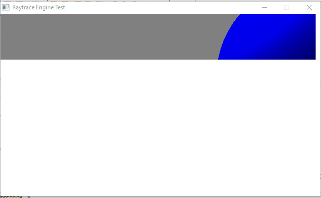
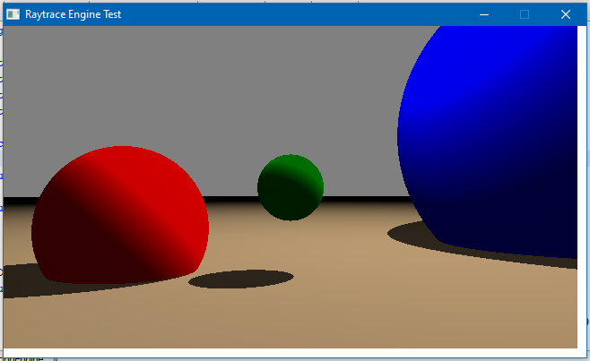

# Raytrace 3D Rendering Engine

[Home](../../../index.md)
|
[Browse Projects](../../browse_projects/browse_projects.md)
|
[Contact Me](../../contact_me/contact_me.md)

## Overview

The raytrace engine project is a set of classes and methods that allows for a user to draw a range of spheres to a screen and then renderer them using the engines inbuilt camera. The spheres have multiple properties that the creator can manipulate including size, position and colour.

The aim of this was to gain a deeper understanding of how industry standard rendering software operates under the hood. To do this research was done on how the technique of raytracing is used to plot out the colour of each pixel on the screen, as well as the various vector formulas required to make it happen. While not a usable set of libraries for actually 3D rendering, the tool still functions well as a resource from which users can learn.

## Media

Here is a video of the engine rendering a scene, this is done pixel by pixel in a scanline fashion.

[Rendering a Scene Video](https://www.youtube.com/watch?v=6mrPSaUM8_Y)

## Download

If you would like to browse the project source code for yourself you can download the project from the link below.

[Raytrace Engine Repository](https://github.com/JGoodHub/Raytrace-Engine)

A pre-built version of the application can be found in the "dist" root directory, this contains a runnable version of the software, a .jar file, that you can use on your machine.

## Screenshots

The rendering engine as various stages of progression.

